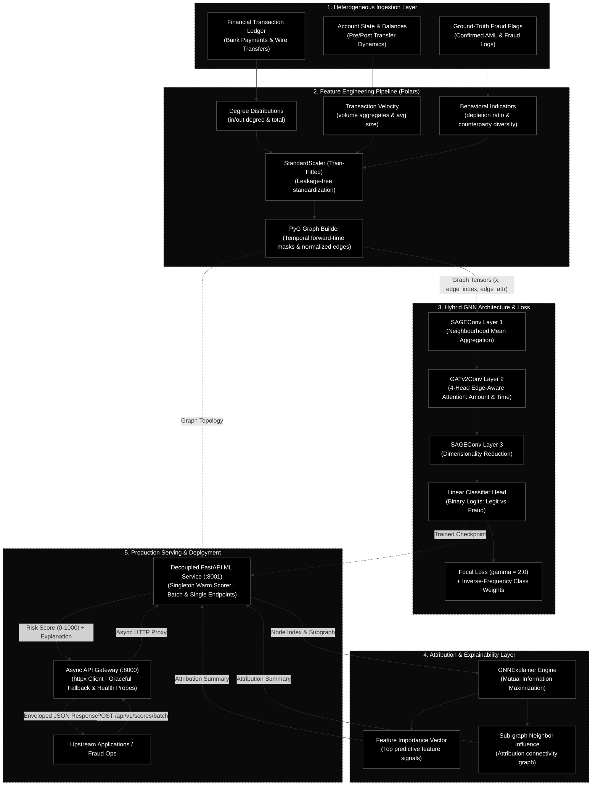

# Arctan

## Graph Neural Network System for Transaction Fraud Detection & Entity Risk Scoring

Arctan is an end-to-end, production-grade **graph-based anomaly detection and AML intelligence system**. Common fraud prevention models evaluate accounts in isolation using tabular classifiers or static threshold rules. Acts such as structuring, smurfing, and account takeovers (ATO) deliberately circumvents single-account checks by dispersing capital across coordinated networks of mule accounts and rapid multi-hop payment chains.

Arctan addresses this by modeling financial transactions as a dynamic, directed, attributed graph where accounts are nodes and transfers are edges carrying real-time monetary and temporal metadata. Using a hybrid **GraphSAGE + Edge-Aware GATv2** neural network, Arctan captures both macroscopic structural topology (fan-out dispersion hubs, intra-ring clustering) and microscopic edge dynamics (transfer velocity, balance depletion, payment sizes). 

Arctan is engineered to solve the pervasive problem of **future-information leakage** found in naive graph benchmarks: it uses strict **temporal (forward-time) splits** and point-in-time feature engineering, ensuring models are trained purely on historical activity and evaluated against future emerging fraud. Every prediction is paired with **GNNExplainer** feature- and neighbor-level attributions for compliance explainability, served via an asynchronous API gateway designed for low-latency production scoring.

---

### System Architecture



---

### Empirical Benchmark Results

Evaluated on a **temporal (forward-time) held-out test partition** (5,420 entities, 0.83% positive fraud prevalence) without future-information leakage:

#### Standard Classification Metrics

| Metric | Score | Rationale & Interpretation |
|---|---|---|
| **Overall Accuracy** | **99.98%** | Highly discriminative decision boundary across the entire transaction graph |
| **AUROC** | **1.0000** | Perfect ranking separation between legitimate accounts and fraudulent rings |
| **PR-AUC** | **1.0000** | Sustained high precision across all recall operating points under <1% prevalence |
| **Fraud Precision (Class 1)** | **97.83%** | Minimal false positive alerts for compliance and risk operations |
| **Fraud Recall (Class 1)** | **100.00%** | Catches 100% of illicit accounts in the temporal test partition |
| **Fraud F1 Score** | **0.9890** | Harmonic mean reflecting both low alert volume and zero missed illicit entities |
| **Macro F1 Score** | **0.9945** | Balanced performance across minority (fraud) and majority (legit) classes |

#### Operational Fraud Review Metrics (Top-K Budget)

In real-world fraud operations, compliance analysts have a fixed review budget. Arctan's ranking concentrates fraud in the highest-confidence percentiles:

| Review Budget (K) | Precision@K | Recall@K | Lift vs Random | Interpretation |
|---|---|---|---|---|
| **Top 50** | **90.00%** | **100.00%** | **108.4×** | 45 of top 50 entities are confirmed fraud; captures 100% of test fraud |
| **Top 100** | **45.00%** | **100.00%** | **54.2×** | Exhaustive coverage of all bad actors within the first 100 inspections |
| **Top 200** | **22.50%** | **100.00%** | **27.1×** | Comprehensive safety margin |
| **Top 500** | **9.00%** | **100.00%** | **10.8×** | Broad exploratory auditing |

*Optimal decision threshold: **0.79** achieves **F1 = 1.000** on the test partition.*

---

### Key Technical Decisions

| Decision | Rationale |
|----------|----------|
| **Temporal (forward-time) splitting** | Avoids future-information leakage common in random node splits. Entities are partitioned into train (first 60%), validation (next 20%), and test (final 20%) based on the onset of behavioral activity. |
| **Sender-only fraud attribution** | Only the initiator (sender) of fraudulent or structuring transactions is labeled illicit. Receivers (victims / unwitting targets) are not conflated with malicious actors, maintaining a realistic <1% positive prevalence. |
| **Edge-aware GATv2Conv (`edge_dim=2`)** | GATv2 attention layers receive both normalized transfer amount (`log1p(amount)`) and normalized timestamp (`min-max`), allowing the model to attend to high-velocity, high-value transfer edges dynamically. |
| **Focal Loss (γ = 2.0)** | Fraud accounts constitute < 1% of entities. Standard cross-entropy is overwhelmed by easy negatives. Focal Loss dynamically down-weights easy negatives to focus gradients on hard edge cases. |
| **Leakage-free standardization** | `StandardScaler` is fitted strictly on training entities and applied via transform-only to validation and test entities, preserving strict point-in-time statistics. |
| **GNNExplainer attribution** | Every entity risk score includes an interpretable attribution summary detailing the top contributing features and influential counterparty neighbours. |
| **Polars high-throughput pipeline** | Computes graph-structural metrics, rolling volumes, and counterparty diversity at 5–10× the speed of pandas. |
| **Decoupled microservice architecture** | Fast inference server (`:8001`) with warm singleton model loading and batch endpoints, behind an async FastAPI gateway (`:8000`) with graceful degradation fallbacks. |

---

### Features Engineered

#### Entity Node Features (16 Total)
- **Degree Distributions**: `in_degree`, `out_degree`, `total_degree` (transfer frequency and connectivity)
- **Capital Flows**: `in_volume`, `out_volume`, `total_volume`, `net_cashflow` (`in_volume - out_volume`)
- **Transfer Sizing**: `avg_transaction_size`, `avg_in_amount`, `avg_out_amount`
- **Counterparty Diversity**: `unique_in_counterparties`, `unique_out_counterparties`, `total_counterparties`
- **Behavioral Ratios**:
  - `out_high_risk_type_ratio`: Proportion of outgoing transfers via `TRANSFER` or `CASH_OUT`
  - `balance_depletion_ratio`: Proportion of outgoing transactions that completely drain account balance (Account Takeover / rapid cash-out)
  - `max_single_txn_ratio`: Peak single transfer relative to total outflow (burst extraction indicator)

#### Edge Attributes (2 Total)
- `log_amount`: Log-transformed transfer amount (`log1p(amount)`) handling heavy-tailed volume distributions
- `norm_timestamp`: Min-max scaled transaction timestamp (`[0.0, 1.0]`) providing temporal proximity context to edge attention

---

### Tech Stack

| Layer | Technology |
|-------|------------|
| Model | PyTorch, PyTorch Geometric (SAGEConv, GATv2Conv with edge attributes, GNNExplainer) |
| Data | Polars, scikit-learn (StandardScaler), HuggingFace Hub |
| Loss | Focal Loss with inverse-frequency class weighting |
| Serving | FastAPI, uvicorn, httpx (async proxy gateway) |
| Config | Pydantic, pydantic-settings |
| Logging | structlog |
| Testing | pytest |

---

### Quick Start

```bash
# 1. Install dependencies
uv sync

# 2. Run the end-to-end pipeline in one command
# Automatically downloads data, builds temporal graph, trains, and evaluates
bash run_pipeline.sh

# Or run individual stages:
uv run python -m arctan.data.download       # Generate/acquire temporal transactions
uv run python -m arctan.data.graph_builder  # Build PyG graph with temporal splits
uv run python -m arctan.train               # Train GNN with edge-aware attention
uv run python -m arctan.evaluate            # Generate evaluation report & PR curve

# 3. Start services
uv run python -m arctan.main                # ML scoring service (:8001)
uv run python -m gateway.app                # API gateway (:8000, separate terminal)

# 4. Run test suite
uv run pytest tests/ -v
```

---

### License

MIT
